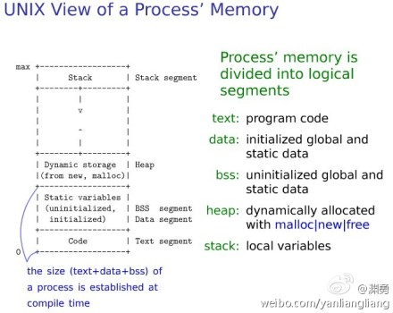

### c程序内存布局
共有6段,从高地址到低地址依次是:

 - stack
 - shared lib
 - heap
 - Uninitialized data segment(.bbs(Block Started by Symbol))
 - Initialized data segment(.data)
 - 代码区(.text) 

 

每个区间都有四个属性:

 - r 表示可以读取。
 - w 表示可以修改。
 - x 表示可以执行。
 - p/s 表示是否为共享内存。

####refer:
- http://www.geeksforgeeks.org/memory-layout-of-c-program/
- http://blog.chinaunix.net/uid-26495963-id-3135098.html

